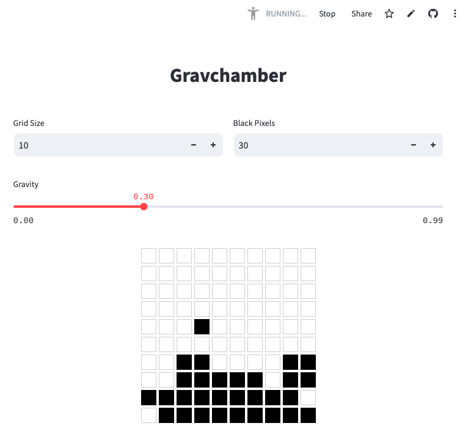

# GravityChamber

GravityChamber is an interactive application for visualizing pixel movements under the influence of gravity.

---

### 🚀 How to Run

To run the application locally, use the following command:

uv run streamlit run app.py

---

### 🌐 Hosted App

The app is live and accessible here:  
[gravitychamber.streamlit.app](https://gravitychamber.streamlit.app/)

---

### 📸 Preview

---

### 📂 Repository Structure

- `app.py`: Main application script.
- `gravchamber.png`: Preview image of the application.
- Other supporting files for the project.
